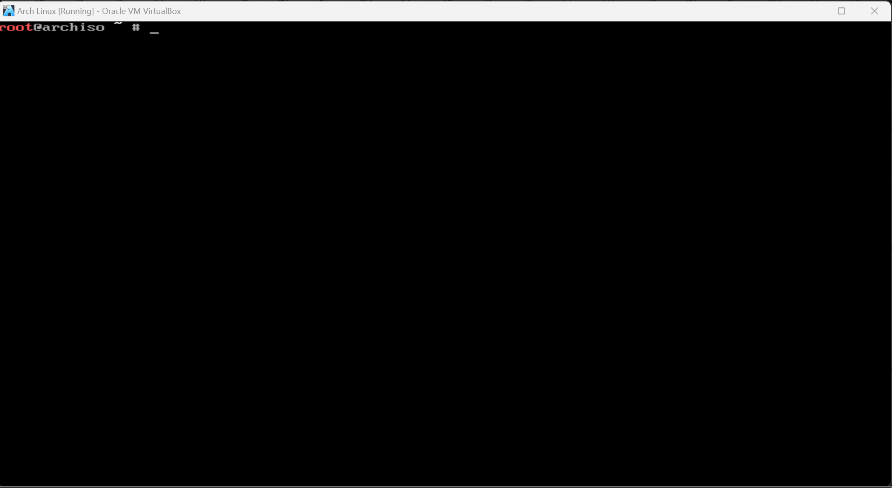
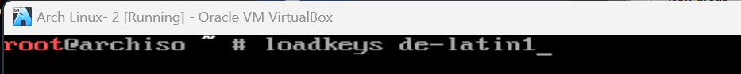
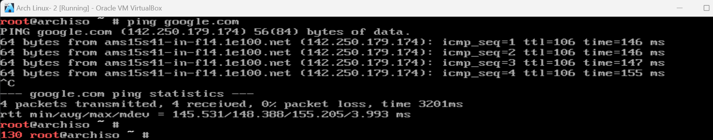
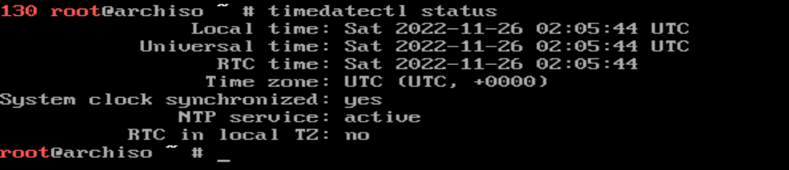
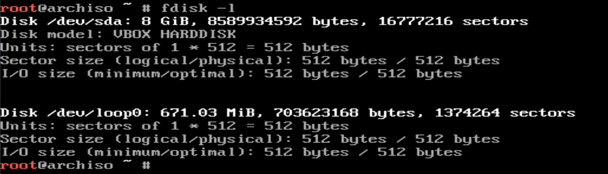
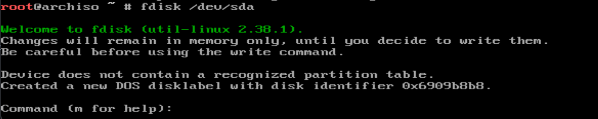
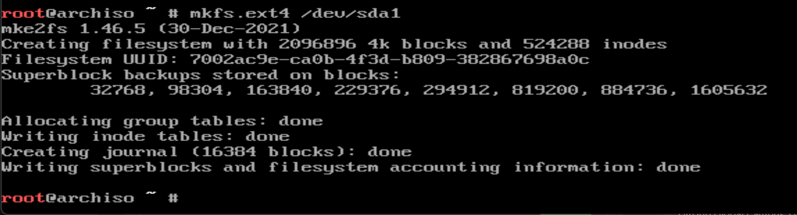
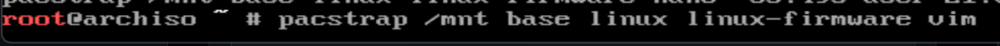

# 2420_makeup
<h1>How to Install Arch Linux after booting it from a disk image</h1>

When you first boot from your disk image, you will see a CLI
<h3>Step 1: Selecting your keyboard layout</h3>
If you're using the US Keyboard layout, you can skip this step. 
This command will list out all available keyboard aszslayouts
<pre><code>ls /usr/share/kbd/keymaps/**/*.map.gz
</code></pre>

Use this command to select your keyboard layout
<pre><code>loadkeys KEYBOARD_LAYOUT</code></pre>

<h3>Step 2: Verify your boot mode</h3>
If this command runs without errors, then you're using UEFI. If this directory doesn't exist, then you're using BIOS or CSM. If those are not your desired boot mediums, go to your motherboard manual to change them in your BIOS
<pre><code>ls /sys/firmware/efi/efivars</code></pre>

<h3>Step 3: Connect to Internet</h3>
This command will verify if your network Interface are listed and enabled
<pre><code>ip link</code></pre>
Plug in your ethernet cable to connect to the internet. If you're using wifi, then you can use iwctl to connect to wifi
Use this command to verify that you're connected to the internet.
<pre><code>ping google.com</code></pre>

<h3> 4: Update the system clock</h3>
Use this command to ensure that your system time is correct 
<pre><code>timedatectl status</code></pre>

<h3>Step 5: Partition the disk</h3>
This command will list all disks
<pre><code>fdisk -l</code></pre>

Now choose the disk you want to install Arch in and then Partiton it. Use this command to Select disk
<pre><code>fdisk /dev/DISK_NAME</code></pre>

If you're UEFI, then create efi partition first, otherwise just create a root partition. We're only creating a root partition but you can create a home partiton and swap partiton too. 

<h3>Step 6: Formatting the partition</h3>
We will format our root partition to ext4 file system and if we created a efi partition, that too Fat32. If we also had a swap partition, we will format it to swap
This will format the single root partition to ext4
<pre><code>mkfs.ext4 /dev/sda1</code></pre>

<h3>Step 7: Mount the root partiton</h3>
Now we will mount the root partition we just created. If we created any other partitons, we will mount them too. 
mount /dev/sda1 /mnt

<h3>Step 8: Installing the kernal</h3>
This command will install essential base packages, kernal and firmware, and also a text editon VIM, which will be useful later
<pre><code>pacstrap /mnt base linux linux-firmware vim</code></pre>

This will take some time so make a cup of coffee in the meantime.

<h3>Step 9: Configuring the System</h3>
This  command will generate fstap file
<pre><code>genfstab -U /mnt >> /mnt/etc/fstab</code></pre>

This command will change root to the new system we just installed
<pre><code>arch-chroot /mnt</code></pre>

This command will set your local timezone
<pre><code>ln -sf /usr/share/zoneinfo/Region/City /etc/localtime</code></pre>
For example, for Vancouver, change /Region/City to America/Vancouver

Then Run this to generate /etc/adjtime
<pre><code>hwclock --systohc</code></pre>

Run passwd to set root passwd
<pre><code>passwd</code></pre>

Use vim to set up localisation
<pre><code>vim /etc/locale/conf</code></pre>
Remove the hashtag infront of the lanaguage your prefer and save
then run
<pre><code>locale-gen</code></pre>

Run this command to set your hostname 
<pre><code>vim /etc/hostname</code></pre>

Install grub(on non efi system)
<pre><code>pacman -S grub</code></pre>
<pre><code>grub-install /dev/sda</code></pre>
<pre><code>grub-mkconfig -o /boot/grub/grub.cfg</code></pre>

<h3>Step 10: Creating a new user</h3>
Use this command to add a new user
<pre><code>useradd -m USERNAME</code></pre>

Then set its password
<pre><code>passwd USERNAME</code></pre>

Now give this user sudo permission
<pre><code>usermod -aG sudo USERNAME</code></pre>

<h3>Reboot</h3>